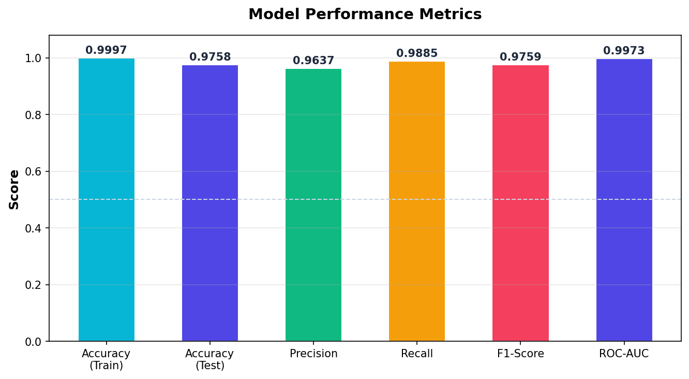
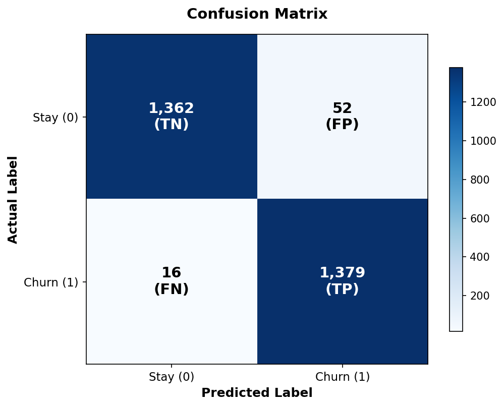
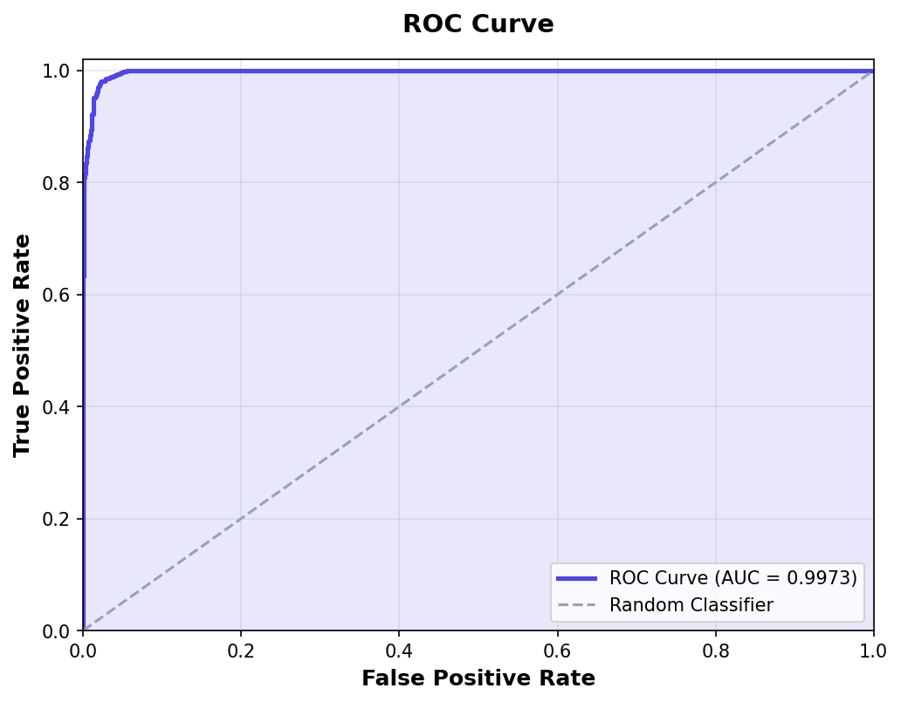
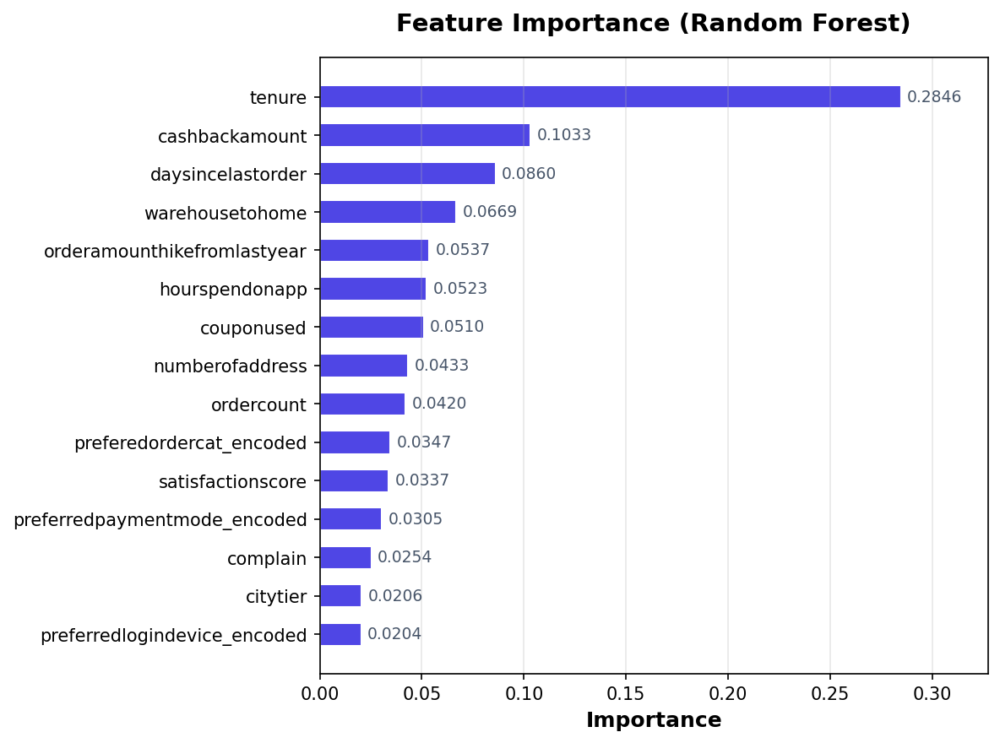

# Churn Prediction Model — Evaluation Report

**Generated:** 2026-03-14T21:09:21.190156

---

## 1. Model Configuration

| Parameter | Value |
|---|---|
| Algorithm | RandomForestClassifier |
| Number of Estimators | 100 |
| Max Depth | 15 |
| Feature Scaler | MinMaxScaler |
| Number of Features | 18 |
| Random State | 42 |

## 2. Dataset Summary

| Parameter | Value |
|---|---|
| Original Rows | 5,630 |
| Resampling | SMOTETomek |
| Resampled Rows | 9,362 |
| Train Rows | 6,553 |
| Test Rows | 2,809 |
| Test Size | 30% |

## 3. Performance Metrics

| Metric | Score |
|---|---|
| **Train Accuracy** | 0.9997 |
| **Test Accuracy** | 0.9758 |
| **Precision** | 0.9637 |
| **Recall** | 0.9885 |
| **F1-Score** | 0.9759 |
| **ROC-AUC** | 0.9973 |



## 4. Confusion Matrix

|  | Predicted: Stay | Predicted: Churn |
|---|---|---|
| **Actual: Stay** | 1,362 (TN) | 52 (FP) |
| **Actual: Churn** | 16 (FN) | 1,379 (TP) |

- **True Positives (correctly predicted churn):** 1,379
- **True Negatives (correctly predicted stay):** 1,362
- **False Positives (incorrectly predicted churn):** 52
- **False Negatives (missed churn):** 16



## 5. ROC Curve

AUC Score: **0.9973**



## 6. Classification Report

| Class | Precision | Recall | F1-Score | Support |
|---|---|---|---|---|
| Stay (0) | 0.9884 | 0.9632 | 0.9756 | 1,414 |
| Churn (1) | 0.9637 | 0.9885 | 0.9759 | 1,395 |
| **Macro Avg** | 0.9760 | 0.9759 | 0.9758 | 2,809 |
| **Weighted Avg** | 0.9761 | 0.9758 | 0.9758 | 2,809 |

## 7. Feature Importance



| Rank | Feature | Importance |
|---|---|---|
| 1 | tenure | 0.2846 ███████████ |
| 2 | cashbackamount | 0.1033 ████ |
| 3 | daysincelastorder | 0.0860 ███ |
| 4 | warehousetohome | 0.0669 ██ |
| 5 | orderamounthikefromlastyear | 0.0537 ██ |
| 6 | hourspendonapp | 0.0523 ██ |
| 7 | couponused | 0.0510 ██ |
| 8 | numberofaddress | 0.0433 █ |
| 9 | ordercount | 0.0420 █ |
| 10 | preferedordercat_encoded | 0.0347 █ |

## 8. All Features Used

```
tenure, citytier, warehousetohome, hourspendonapp, numberofdeviceregistered, satisfactionscore, numberofaddress, complain, orderamounthikefromlastyear, couponused, ordercount, daysincelastorder, cashbackamount, preferredlogindevice_encoded, gender_encoded, maritalstatus_encoded, preferedordercat_encoded, preferredpaymentmode_encoded
```

---

*Report generated by `src.ml.predict_churn` pipeline.*
